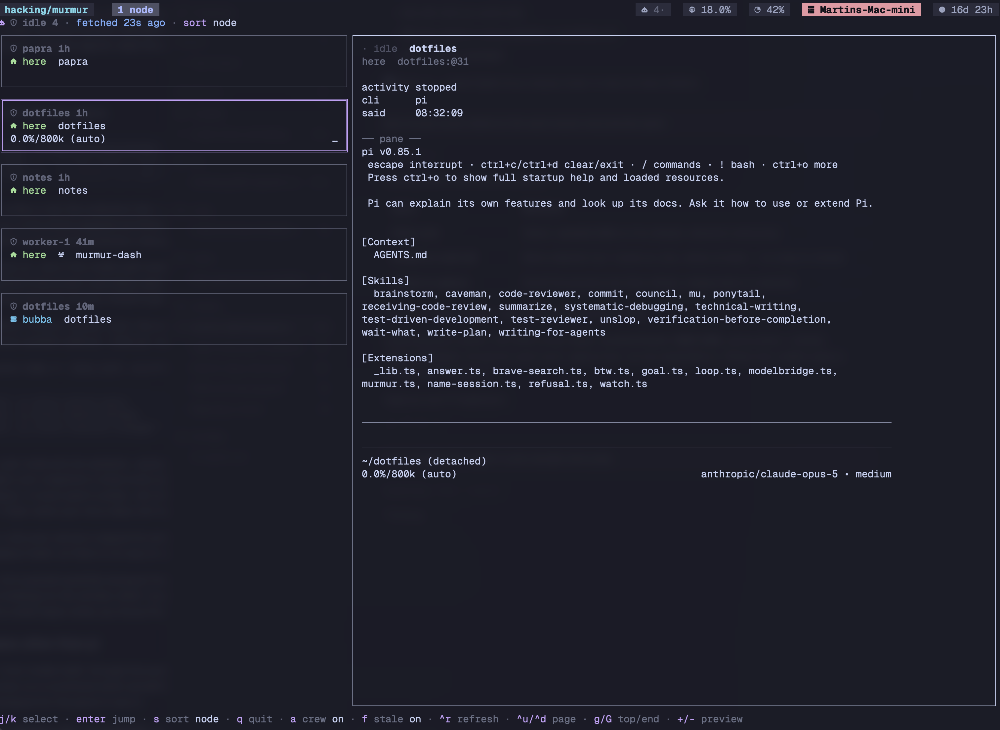

# murmur

**Every coding agent you have running, on every machine, in one list.**



One agent is blocked waiting on you. Which machine is it on? murmur answers
that and jumps you there.

## Surfaces

| Command | Job |
| --- | --- |
| `murmur status` | Counts for a tmux status bar |
| `murmur pick` | fzf jump list — type to narrow, enter jumps, `ctrl-a` / `--all` toggles crew |
| `murmur dash` | Live cards + pane glance (screenshot above) |

Orchestrated (`crew`) agents stay hidden unless they are `blocked` or `crashed`
— their supervisor consumes anything else. Local jump is a window switch;
remote jump opens over ssh (or your `--jump-command`).

`murmur dash` wants a [Nerd Font](https://www.nerdfonts.com/) and a Catppuccin
Mocha terminal. Keys: `j`/`k` select, enter jump, click selects, double-click
jumps, wheel scrolls the card rail or the glance, `s` cycles sort, `q` quits.
`s` **node** sort is local cards first, then remotes A–Z.

## Install

Needs tmux, [pi](https://github.com/earendil-works/pi-coding-agent), `fzf`, and
Node 20+. Multi-machine: ssh access, murmur on each node.

On every node that runs agents:

```bash
npm install -g @martintrojer/murmur
murmur init      # this node's identity
murmur link pi   # install the agent-side extension
```

Agents must run **inside tmux**. A pane is the address; without one there is
nothing to jump to. Remote agents need tmux on the remote too — the jump is
`ssh -t <host> tmux attach` (unless you override it).

Add focus hooks so looking at a finished agent clears its badge — see
[docs/setup.md](docs/setup.md#tmux-focus-hooks). Wire Codex / Cursor /
opencode notify hooks in the same file.

### Watch more than one machine

```bash
murmur peer add devbox
murmur doctor            # is peering mutual?
bind -N "agent state picker" a display-popup -E -w 80% -h 60% "murmur pick"
```

Peering is one-way until both sides add each other. Hard ssh cases (second
factor / `BatchMode`, `MaxSessions 1`, Eternal Terminal): [SSH.md](SSH.md).

## What it is / is not

- **Is:** a state layer over tmux — reported from inside the agent (not scraped
  from pane output), pulled peer-to-peer over ssh. No daemon. Current snapshot
  only; a peer answer is replaced whole, and absence means absence.
- **Is not:** an orchestrator ([`mu`](https://github.com/martintrojer/mu)
  places work), a remote terminal, or a multiplexer replacement.

## Docs

| Doc | For |
| --- | --- |
| [docs/setup.md](docs/setup.md) | Hooks, harness notify, peers, doctor, jump |
| [SSH.md](SSH.md) | Auth, session caps, control masters |
| [ARCHITECTURE.md](ARCHITECTURE.md) | Model, design choices, gaps |
| [AGENTS.md](AGENTS.md) | Repo gate for agents working on murmur |

**0.2.6.** In daily use; not battle-tested. Known gaps live at the end of
[ARCHITECTURE.md](ARCHITECTURE.md#known-gaps).
